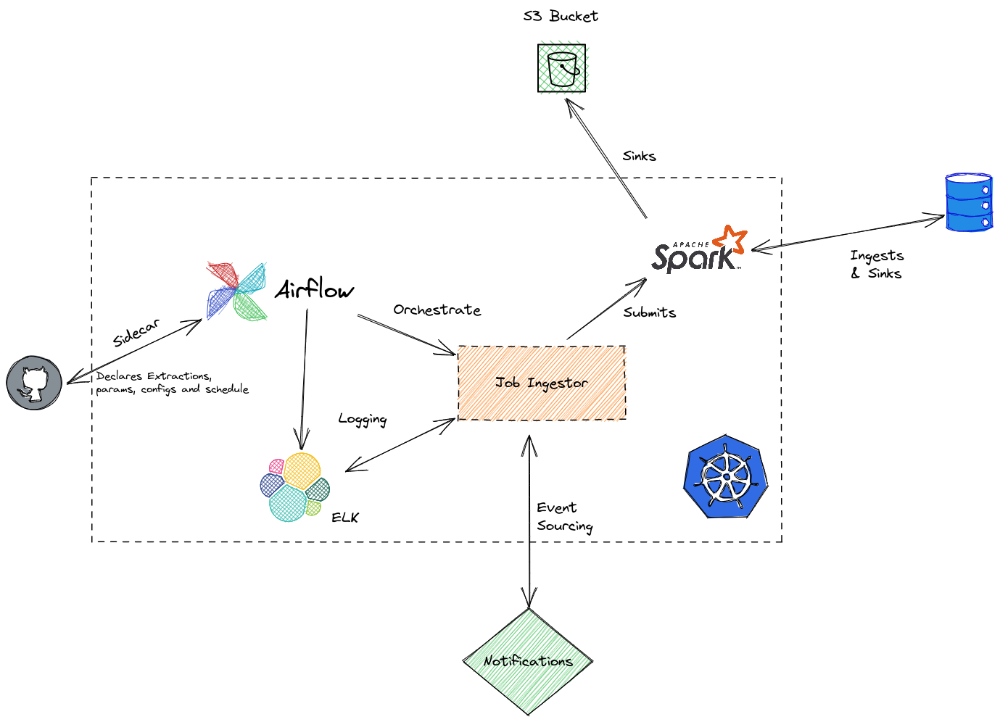

- [1. Intro](#1-intro)
- [2. Project Structure](#2-project-structure)
- [3. Mandatory Features:](#3-mandatory-features)
- [4. Running Samples](#4-running-samples)
  - [4.1. Reading from CSV and Sinking to JDBC](#41-reading-from-csv-and-sinking-to-jdbc)
  - [4.2. Reading from JDBC and Sinking to CSV - Aggregated Pipeline](#42-reading-from-jdbc-and-sinking-to-csv---aggregated-pipeline)
- [5. Scalability](#5-scalability)
- [6. On the Cloud](#6-on-the-cloud)
- [7. Future Enhancements](#7-future-enhancements)
  - [7.1. Testing](#71-testing)
  
## 1. Intro

This is a simple pipeline processing tool, consisting of three core ideas:
- Loads
- Sinks
- Pipelines

**Loads** Specifies how the dataframe will be loaded

**Pipelines** Specifies a order of functions to process a dataframe

**Sinks** Specifies where files will be written

## 2. Project Structure

```
.
├── docker-compose.yaml
├── Dockerfile
├── Makefile
├── README.MD
└── src
    ├── adapters
    │   └── slack.py
    ├── domain
    │   └── events.py
    ├── load
    │   ├── base_load.py
    │   ├── generic_pyspark.py
    │   ├── __init__.py
    │   └── jdbc.py
    ├── main.py
    ├── pipeline
    │   ├── base_pipeline.py
    │   ├── __init__.py
    │   ├── trips_aggregated.py
    │   └── trips.py
    ├── services
    │   └── message_bus.py
    ├── sink
    │   ├── base_sink.py
    │   ├── generic_pyspark.py
    │   ├── __init__.py
    │   └── jdbc.py
    └── utils
        ├── decode.py
        └── logger.py
```

## 3. Mandatory Features:
- There must be an automated process to ingest and store the data. 100%

---

- Trips with similar origin, destination, and time of day should be grouped together. 100%

---

- Develop a way to obtain the weekly average number of trips for an area, defined by a
bounding box (given by coordinates) or by a region. 100%

*Commentary*: This is ambiguous - what happens if there is only one week? Should be it averaged for a time window? Since when should we consider? Entire 2018? or max min of the dataset itself? I've decided to not left join there and simply average weeks that had at least one travel.

Also important: I've decided to do this fully on Spark - a wiser implementation would check the instances of the loading pipeline and, if is a JDBC - run the query within the Database to minimize data flow/I.O.  There should be two approaches there - one with spark (if the source is a non-jdbc) and one proper for JDBC cons.

---

- Develop a way to inform the user about the status of the data ingestion without using a
polling solution. 100% (NO CREDS THERE)

*Commentary*: I've create a sort of message bus - with a simple slack model there. It could be a webhook? Email? SMS? All of the previous? Simple to hook up a new adapter and set each notification for each event.

---

- The solution should be scalable to 100 million entries. It is encouraged to simplify the
data by a data model. Please add proof that the solution is scalable. 50%

*Commentary*:
Data models are controversial - mainly in this scenario - Indeed I could create auxiliary tables for: City and Dates, but this is non practical whenever is only a single table - this won't make the solution less or more scalable and worst: will require joins there. 

In stores such as columnar stores, data modeling in this scenario should be carefully reviewed - It may bring organization, but it adds complexity and, depending on the stack, increases the computational load for both reading (consumer/end user) and writing (pipeline processes).

For scalability, please refer to item [6. Scalability](#5-scalability)

---

- Use a SQL database. 100%

*Commentary*: Postgres.

---

## 4. Running Samples

### 4.1. Reading from CSV and Sinking to JDBC

PS: `conn_uri` is base64 decoded for the sake of special characters breaking args.

If local: `jdbc:postgresql://localhost:5432/jobsity?user=naniviaa&password=123456`
If on Docker: `jdbc:postgresql://postgres:5432/jobsity?user=naniviaa&password=123456` which translates to base64: `amRiYzpwb3N0Z3Jlc3FsOi8vcG9zdGdyZXM6NTQzMi9qb2JzaXR5P3VzZXI9bmFuaXZpYWEmcGFz
c3dvcmQ9MTIzNDU2` 

``` 
python main.py --load-config '{"load_type":"GenericPySparkLoad", "options": {"path": "./application/input/sample.csv", "format": "csv", "header": "true"} }' \
               --sink-config '{"sink_type": "JDBCSink", "options":{"conn_uri": "amRiYzpwb3N0Z3Jlc3FsOi8vbG9jYWxob3N0OjU0MzIvam9ic2l0eT91c2VyPW5hbml2aWFhJnBhc3N3b3JkPTEyMzQ1Ng==", "table": "trips"} }' \
               --pipeline '{"pipeline_name": "Trips", "options":{}}'
```

### 4.2. Reading from JDBC and Sinking to CSV - Aggregated Pipeline
```
python main.py --load-config '{"load_type":"JDBCLoad", "options":{"conn_uri": "amRiYzpwb3N0Z3Jlc3FsOi8vbG9jYWxob3N0OjU0MzIvam9ic2l0eT91c2VyPW5hbml2aWFhJnBhc3N3b3JkPTEyMzQ1Ng==", "table": "trips"}  }' \
               --sink-config '{"sink_type": "GenericPySparkSink", "options":{"format":"json", "path":"./application_data/output/python/", "mode":"overwrite"}}' \
               --pipeline '{"pipeline_name": "TripsAggregated", "options":{"region":"Turin", "p1":[7.54, 44], "p2":[7.70, 46]}}'
```

## 5. Scalability

Spark lazy evaluates all dataframes - shuffling either through multiple workers or spilling it to disk whenever it cannot handle all data.
While a Docker solution makes little sense in the standpoint of scalability as you're simply adding overhead to your local machine, this is an initial step for a high scalable solution, which could be deployed in either:
- Spark @ AWS EMR Clusters
- YARN
- K8s - [There is an interesting operator built by GCP that can enable this](https://github.com/GoogleCloudPlatform/spark-on-k8s-operator)

**Enhancements - SQL Wise**: I could have used partition columns & fetch size for parallelizing on read - Check docs for "partitionColumn, lowerBound, upperBound" in [Spark Docs](https://spark.apache.org/docs/latest/sql-data-sources-jdbc.html).

**Enhancements - FS**: Use `repartition` (distributing partitions in memory) and `partitionBy` (distributing partitions in disk) if this ever scale.

## 6. On the Cloud

This is a simple drawing that illustrates how those pieces could fit together in a K8s context. This is an oversimplified architecture, more close to a batch ingestion.


## 7. Future Enhancements

### 7.1. Testing
I would like to introduce at very least some unit testings there - I didn't cause I've done this in pretty much one and a half day. 

Each pipeline should have each of those methods tested, while the CSV/Parquet/JSON sinks and loads could be easily tested - those in JDBC context will need `sqlalchemy` and even a docker instance for proper testing (and integrations one).
